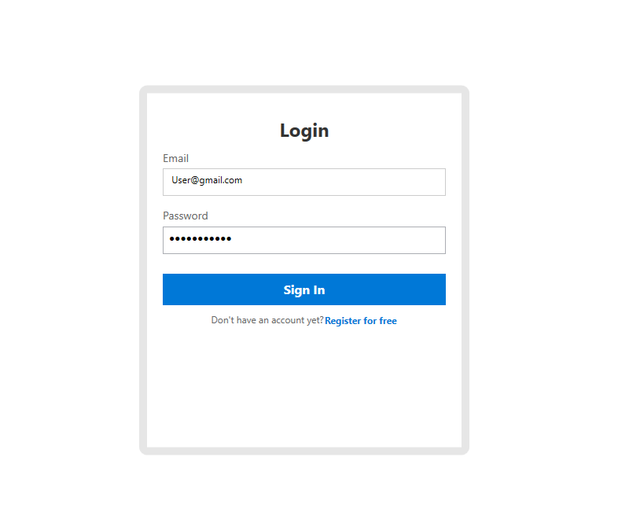
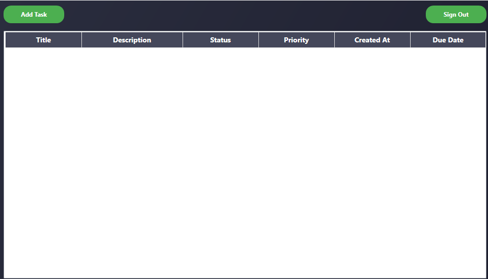
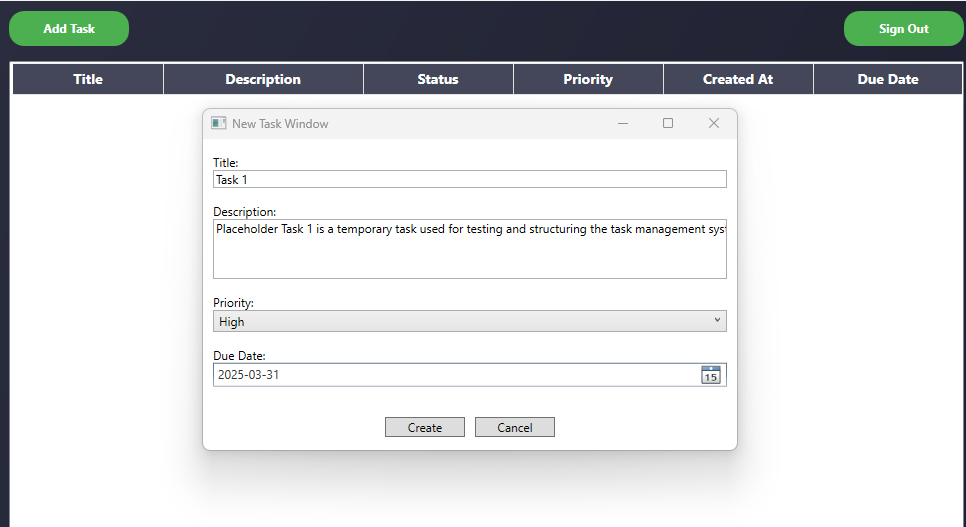
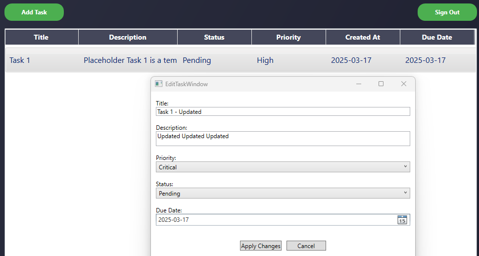
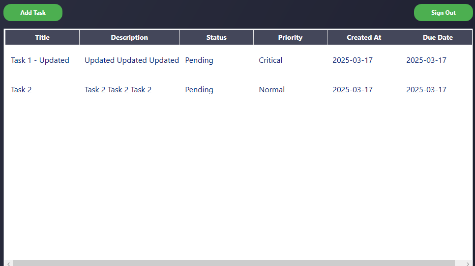
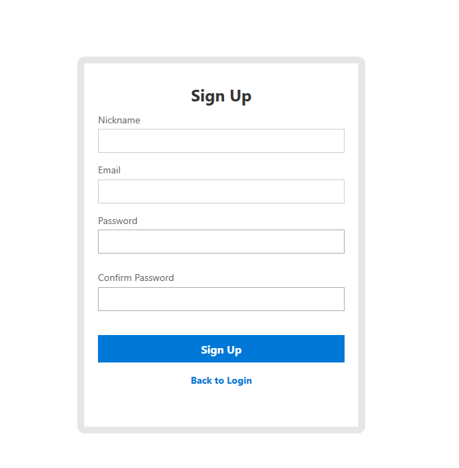

# Task Manager

## Overview
Task Manager is a WPF-based desktop application with an ASP.NET Web API backend. It allows users to manage tasks with features such as authentication, task creation, and real-time updates.

## Screenshots

### 1. Login Screen

### 2. Task List View / Dashboard

### 3. Create New Task

### 4. Edit Task

### 5. Updated Task List

### 6. Signup Page

---

## Features
### WPF GUI Application
- **User Authentication:** Sign Up and Sign In support.
- **Task Management:** Add, view, update, and delete tasks.
- **Dashboard:** Displays tasks with details like title, description, status, priority, and due date.
- **Session Management:** Utilizes tokens for API authentication.
- **Modern UI:** Built with WPF and MVVM pattern.

### ASP.NET Web API
- **Authentication:** JWT-based user authentication.
- **RESTful Endpoints:** Supports CRUD operations for tasks.
- **Secure:** Role-based access for endpoints.
- **Clean Architecture:** Separated layers for API, Application, Domain, and Infrastructure.

---

## Tech Stack
- **Frontend:** WPF (.NET 9+)
- **Backend:** ASP.NET Core Web API
- **Database:** PostgreSQL
- **Authentication:** ASP.NET Identity
- **API Testing:** Postman, HTTPie
- **Language:** C#

---

## Setup Instructions

### Prerequisites
- .NET SDK 6.0+
- PostgreSQL
- Visual Studio 2022

---

